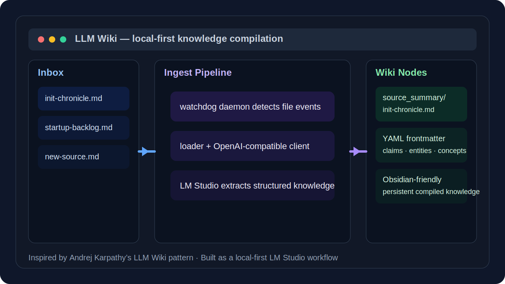

# LLM Wiki

[English](./README.md)

[](https://github.com/cjian8888/llm-wiki/releases)
[](./LICENSE)
[](./Dockerfile)
[](https://lmstudio.ai/)

一个基于 Karpathy 的 **LLM Wiki** 模式构建的、本地优先、可持续演进的知识库系统。

这个项目不把知识管理当作“每次查询时重新检索原始文档”的 RAG 问题，而是把摄入过程当作一种“编译”：每一份新资料都会被转换成结构化 wiki 节点，并在后续持续积累、互联和演进。



## 创意来源

本项目是对 **Andrej Karpathy 提出的 LLM Wiki 模式** 的工程化落地实现。

- 创意来源文档：`docs/karpathy_design_pattern.md`
- 原始思想核心：让 LLM 持续维护一个持久化 wiki，而不是只在查询时做一次性 RAG 检索
- 本仓库将这一模式实现为一个本地优先、基于 Docker、接入 LM Studio 的工作流

## 项目亮点

- 基于 LM Studio 的本地优先摄入流程
- 使用 `watchdog` 的自动 inbox 监听守护进程
- OpenAI 兼容接口的模型调用层
- 带 YAML Frontmatter 的结构化 Markdown 输出
- 对 Obsidian 友好的知识节点目录结构
- 摄入成功后自动归档原始文件
- 同时支持启动时 backlog 扫描与运行时实时监听

## 架构分层

系统分为三层：

1. **基础设施层**
   - Docker / Docker Compose
   - `scripts/daemon.py`
   - `watchdog` 文件事件监听

2. **能力层**
   - `scripts/lib/loader.py` — 负责源文件读取
   - `scripts/lib/llm_client.py` — 通过 OpenAI 兼容接口调用模型
   - `scripts/ingest.py` — 负责编排、渲染与归档

3. **知识层**
   - `wiki_nodes/source_summary/*.md`
   - 使用 YAML frontmatter 存储元数据
   - 使用 Markdown 正文存储摘要、主张、实体与概念

## 仓库结构

```text
.
├── assets/                   # 图片与辅助资源
├── docs/                     # 设计文档与实现蓝图
├── inbox/                    # 将待摄入的源文件放在这里
│   └── archived/             # 成功摄入后的归档文件
├── scripts/
│   ├── daemon.py             # 长运行 inbox 监听守护进程
│   ├── ingest.py             # 端到端摄入管道
│   └── lib/
│       ├── llm_client.py     # OpenAI 兼容 LLM 客户端
│       └── loader.py         # 源文档加载器
├── wiki_nodes/
│   └── source_summary/       # 生成后的 wiki 节点
├── CLAUDE.md                 # 极简项目指针说明
├── docker-compose.yml
├── Dockerfile
├── requirements.txt
└── README.md
```

## 工作流程

1. 将 `.md` 或 `.txt` 文件放入 `inbox/`
2. 守护进程检测新文件，或在启动时处理已存在的 backlog 文件
3. 摄入管道加载文档文本
4. 调用配置好的模型提取：
   - 摘要
   - 关键主张
   - 实体
   - 概念
5. 将结果写入 `wiki_nodes/source_summary/`
6. 将原始文件移动到 `inbox/archived/`

## 当前运行环境

当前项目默认使用 **LM Studio** 作为本地 OpenAI 兼容后端。

示例 `.env`：

```env
LLM_BASE_URL="http://host.docker.internal:1234/v1"
LLM_API_KEY="lm-studio"
LLM_MODEL_NAME="gemma-4-e4b-it"
```

说明：
- 必须先在 LM Studio 中启用 **Local Server**
- 必须先加载好要使用的模型
- 因为守护进程运行在 Docker 容器内，所以容器里访问宿主机要使用 `host.docker.internal`，不能直接写 `localhost`

## 快速开始

### 1. 启动 LM Studio 本地服务

在 LM Studio 中：
- 打开 **Developer > Local Server**
- 加载一个模型
- 确认 OpenAI 兼容服务已经启动

你也可以在本机验证：

```bash
curl http://localhost:1234/v1/models
```

### 2. 配置环境变量

根据 `.env.example` 创建 `.env`，然后将其指向你的 LM Studio 服务或其他 OpenAI 兼容后端。

### 3. 启动守护进程

```bash
docker compose up --build -d
```

### 4. 放入一个源文件到 `inbox/`

例如：

```bash
cp some-note.md inbox/
```

### 5. 查看输出结果

生成的 wiki 节点：

```text
wiki_nodes/source_summary/<slug>.md
```

归档后的原始文件：

```text
inbox/archived/<original-file>
```

### 6. 停止守护进程

```bash
docker compose down
```

## 生成节点格式

每个生成节点都包含 YAML frontmatter 和结构化正文：

```yaml
---
id: "example-slug"
title: "Example Slug"
type: source_summary
tags:
  - example
created: "2026-04-06"
updated: "2026-04-06"
source_file: "inbox/example.md"
source_count: 1
status: active
confidence: medium
related: []
---
```

正文部分包括：
- 摘要
- 关键主张
- 实体
- 核心概念
- 开放问题 / 知识盲区
- 参考来源

## 当前状态

已实现：
- 容器化守护进程运行时
- OpenAI 兼容 LLM 客户端
- 本地 LM Studio 集成
- 启动时 backlog 摄入
- 文件事件驱动的实时摄入
- 成功后自动归档

规划中：
- Lint / 知识图谱维护流程
- 自动 interlink
- 跨节点矛盾检测
- 更丰富的概念图谱生成

## 开发说明

- 当前支持的源文件格式：`.md`、`.txt`
- 守护进程当前按顺序串行处理文件
- 成功摄入依赖模型返回合法的结构化 JSON
- 项目约定 `CLAUDE.md` 保持极简，将架构细节放入 `docs/`

## License

本项目基于 MIT License 发布。详见 [LICENSE](./LICENSE)。
